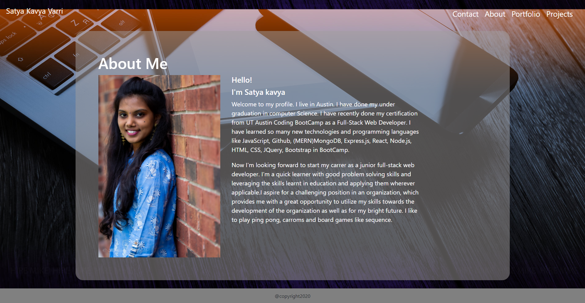

# React Myportfolio

# Application Does:
* This portfolio is developed using React.It contains information about my education, projects links, github link, resume, linked-in, gmail id.

# Technologies used:
* React , Bootstrap, css

# Features
* Gives information about me
* Has contact details
* Included Resume,Github,Projects links
* Deployed project links
* Fixed Navbar and footer
* Used display flex to align items
* Used selectors,positions
* Typography
* Inline,Internal,external css

# Sample web page

# Github repository
 https://github.com/vsatyakavya/ReactMyPortfolio  

 
 
# Github Page
https://vsatyakavya.github.io/ReactMyPortfolio/

# contact Information
satyakavya24@gmail.com

@copyright 2020
